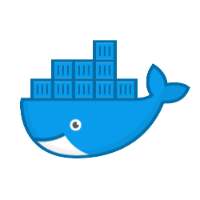
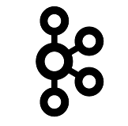

# Shop Now

## Overview
Simple shopping management system, built for learning proposes.

User can browse for catalog, add items to cart, edit his cart and then place order.
In addition, there is admin capability. The admin can manage orders, and view major user transactions.

Back end (BE) done using micro services (along with Eureka, API gateway and others) and run as docker containers (via docker compose).
User interface done using react with redux.

For now the system is capable only to run on local computer.

To run it, download the code using “git clone” and follow the installation and run instructions as below.

## Technologies and key features

|   |  | 
| :---: | :---: |
|| Spring boot |
|| Open feign (calling between ms) |
|| H2 in memory database (with JPA) |
|| OpenAPI (swagger automatic documentation) |
|| docker (with compose) |
|| Zipkin (tracing between ms calls) via rabbitMQ |
|| Kafka (messages between ms) |
|| Swagger-ui (view all the rest definitions – e.g. URL, request/response) |
|| Actuator (system status and details) |
|| HAL browser (system links) |
|| XSS validation (when parsing the UI input + data types validation) |
|| customized spring annotations (enable) |
|| customized exception handling |
|| roles validation (in the api gateway) |
|| react UI with redux and functional components (hooks) |
|| ESlint (UI code standards validation) |
|| session id and transaction id sent on every transaction to the BE |
|| UI automation testing (incl negative tests) using selenium, moca, chai, nodeJs |
|| Rest automation testing using rest assure, testng |

## Architecture and components


- **catalog-service** - responsible for the catalog domain - categories, items in category (phones, accessories)
- **orders-service** - responsible for the order managemant domain - create order, add items to order, place / close / cancel order. Communicates with catalog-service via feign to get catalog details. Sends events to kafka for major items - order creation or cancellation
- **users-service** - responsible for the users domain - create user, authenticate, search by email. Communicates with orders-service via feign to get order details for user. Sends events to kafka for major items - user creation or deletion.
- **tracking service** - responsible for the notifications domain - read notification from kafka and store in DB, retrieve user notifications
- **API gateway** - gateway between external source requests to the micro services. Provides filters of logging and security (such as roles and XSS)
- **naming-service** - eureka service. Responsible for find the ms by name (e.g. catalog-service) instead of exact host and port
- **UI** - simple GUI built and react and covers all system functionality. 2 types of systems, redirected after login based on user roles: 1) regular user - can view catalog, create orders, view and manage his account 2) admin - can close order and view user notifications (major actions)
- there are 2 types of sanity tests 1) rest automation - check all rests return correct response code (e.g. 200 for success and 404 if sending invalid data) and their response 2) UI automation - using selenium, simulate user operations on the UI (button clicks, etc) and check result (e.g. notification message) are as expected
- the micro services are traced using zipkin (via rabbitMQ notification system). All the transactions get's unique id from zipkin. All log entries from docker log are saved into a file in the file system

## Installation on local PC

1.	Install UI libraries
```
[user-ui] [user-ui-automation]
npm install
```
2.	Install docker (if not already have)

3.	Install micro services images on docker
```
[catalog-service] [api-gateway] [naming-service] [orders-service] [tracking-service] [users-service]
spring-boot:build-image -DskipTests

Make sure eslint report is ok (you can run via “npm run eslint” to get updated report)

If need to re-build container on same machine, run 
docker-compose -f docker-compose-filename.yml down
docker-compose -f docker-compose-filename.yml up

or get the problematic image and delete
docker-compose ps
docker-compose rm
```

## Run on local PC

1.	**Run micro services
```
Root folder
startDocker.cmd
tailDocker.cmd
```

2.	**Verify all ms are up
```
run health-check/startHealthCheck.cmd
once you see message "UP!!!!!!!!!!!!!!!!!!!!" all ms in the project are up
```

3.	**Run rest automation (basic sanity)
```
run rest-automation/startRestAutomation.cmd
If you see in the CMD: "[INFO] Tests run: XX, Failures: 0, Errors: 0, Skipped: 0" all passed with success.
If not, you can check the report to get which test failed.
Detailed report will be generated under reports/rest-testing (view  report in chrome browser)
```

4.	**Start UI
```
run user-ui/startClient.cmd
Once UI is up, it will open in IE
```

5.	**Verify UI homepage opens
```
http://localhost:7000/
For now application supports chrome only
Run with -disable-web-security
```

6.	**Perform full automation
```
run user-ui-automation/startUIAutomation.cmd
If you see in CMD: "TEST Login Failure PASSED" "SUITE Basic Sanity FINISHED" "SUITE  FINISHED" "RUN FINISHED" all passed with success.
If not, you can check the report to get which test failed.
Detailed report will be generated reports/ui-testing (view report in chrome browser)
```

## Links

-	**UI URL
Best to run in chrome browser
http://localhost:7000/

-	**Rest addresses
    - Catalog service                       http://localhost:8000
    - Order management service http://localhost:8100
    - Users service                          http://localhost:8200
    - Tracking service                     http://localhost:8300

-	**Rest API Gateway URLs
    - Catalog service                       http://localhost:8666/catalog-service/msp/catalog/...
    - Order management service http://localhost:8666/orders-service/msp/orders/...
    - Users service                          http://localhost:8666/users-service/msp/users/...
    - Tracking service                     http://localhost:8666/tracking-service/msp/tracking/...

-	**Actuator URL (links to all actuator fields)
    - http://<service_address>/actuator

-	**HAL browser (explore the system links)
    - http://<service_address>/browser/index.html

-	**Swagger UI  (Put /v3/api-docs in the explore)
    - http://<service_address>/swagger-ui/index.html

-	**H2 console  (in memory DB console - view and update if required)
    - http://<service_address>/h2-console/

-	**Eureka console
    - http://localhost:8888/

-	**Zipkin console (server calls tracing)
    - http://localhost:9411/

### TODO

-	multiple instances of ms
-	config server
-	retry for service
-	Kubernetes
-	user token (send in ms header, and to all sub ms)
-	data fencing
-	add more catalog items - more phones and accessories
-	elastic search on logs (put logs in FS) by session and transaction id
-	config catalog view admin (can save  to json once closing the ms, and load json on ms startup)
-	create repository of images (don't use arbitrary images)
