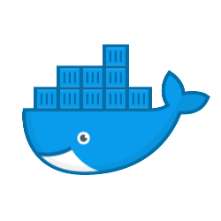
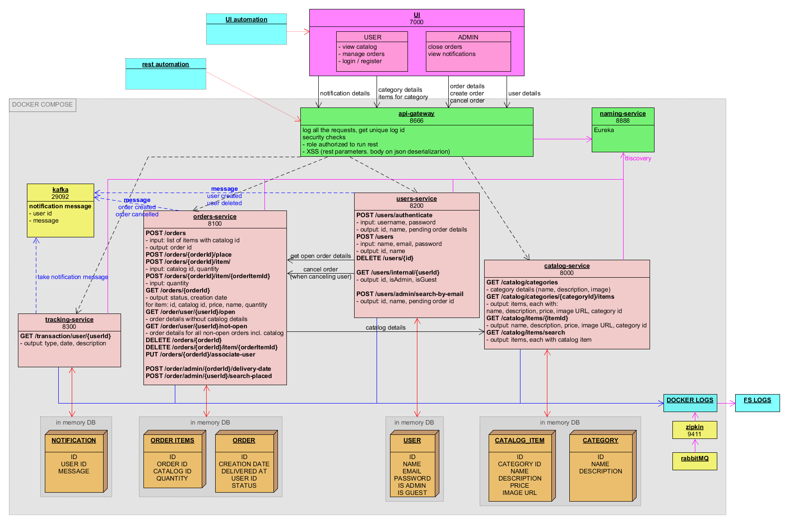
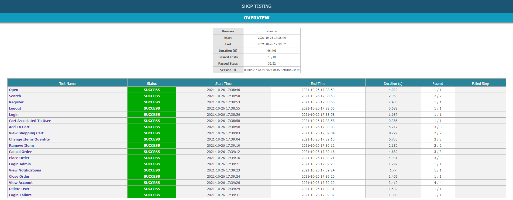
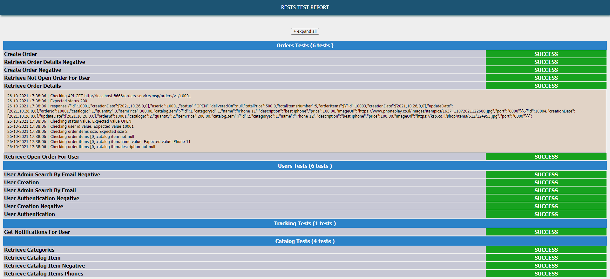
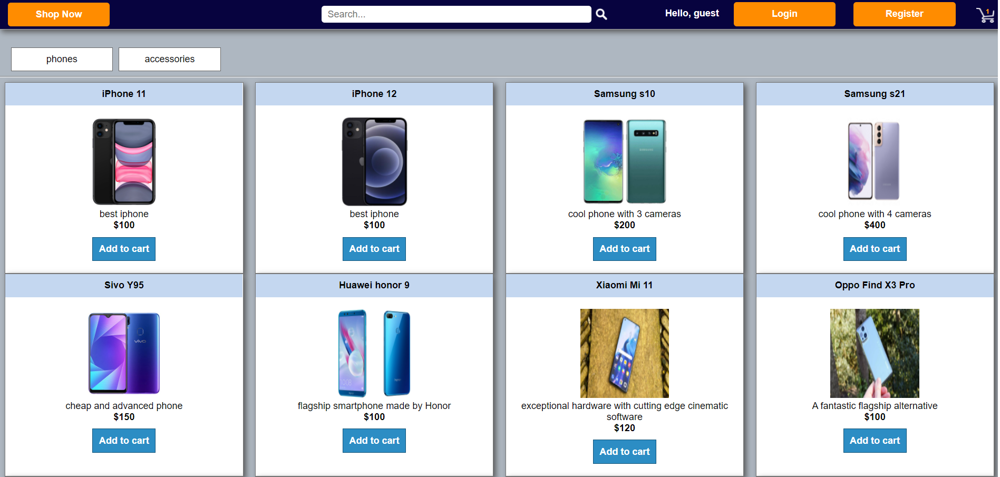
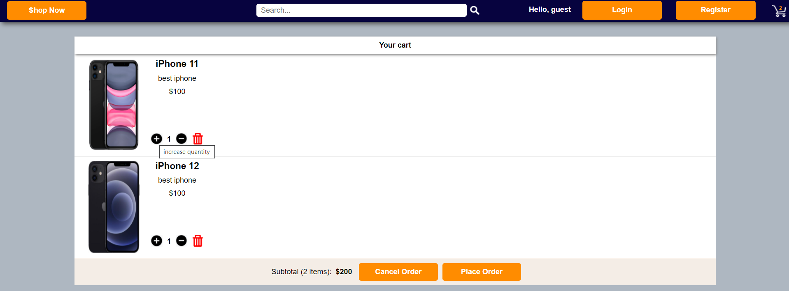
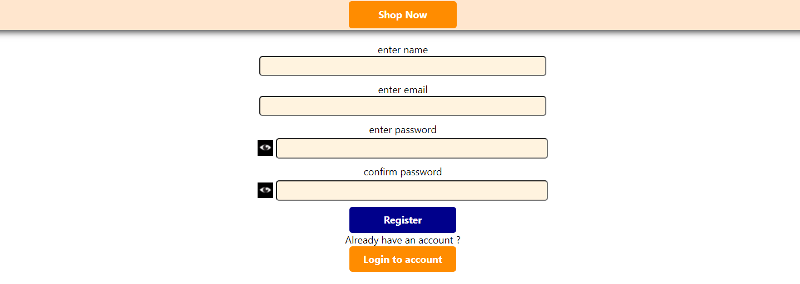
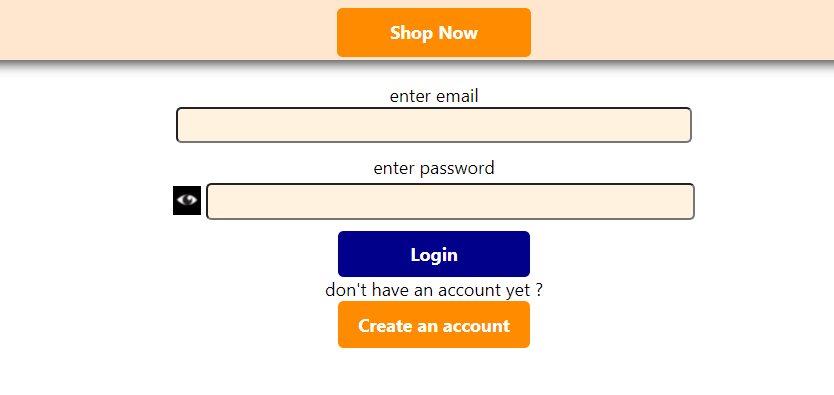
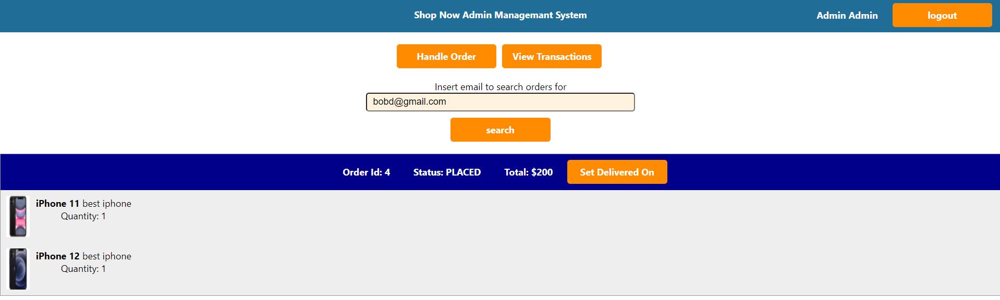
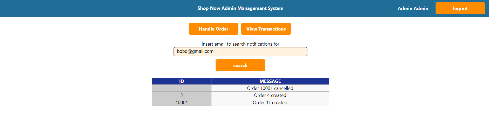

# Shop Now

## Overview
Simple shopping management system, built for learning proposes.

User can browse for catalog, add items to cart, edit his cart and then place order.
In addition, there is admin capability. The admin can manage orders, and view major user transactions.

Back end (BE) done using list of micro services built with spring boot, along with Eureka, API gateway and others and run as docker containers (via docker compose).
User interface done using react with redux.

To certify system integrity after code changes 2 types of automation testing done - rest testing and ui testing. The testing produces clear and informaive report.

For now the system is capable only to run on local computer.
To run it, download the code using “git clone” and follow the installation and run instructions as below.

## Technologies and key features

|   |  | 
| :---: | :---: |
|| Spring boot |
|| Open feign (calling between ms) |
|| H2 in memory database (with JPA) |
|| OpenAPI (swagger automatic documentation) |
|| docker (with compose) |
|| Zipkin (tracing between ms calls) via rabbitMQ |
|| Kafka (messages between ms) |
|| Swagger-ui (view all the rest definitions – e.g. URL, request/response) |
|| Actuator (system status and details) |
|| HAL browser (system links) |
|| XSS validation (when parsing the UI input + data types validation) |
|| customized spring annotations (enable) |
|| customized exception handling |
|| roles validation (in the api gateway) |
|| react UI with redux, redux-thunk and functional components (hooks) |
|| ESlint (UI code standards validation) |
|| session id and transaction id sent on every transaction to the BE |
|| UI automation testing using selenium, moca, chai, npm|
|| Rest automation testing using rest assure, testng |


## Installation on local PC
1.	**Install docker (if not already have)**
2.	**Install maven (if not already have)**
3.	**Install npm (if not already have)**
4.	**Install UI libraries**<br/>
~/user-ui    ~/user-ui-automation
Run in cmd:
```
npm install
```

5.	**Install micro services images on docker**<br/>
./catalog-service    ./api-gateway    ./naming-service    ./orders-service    ./tracking-service    ~/users-service
Run in cmd:
```
mvn spring-boot:build-image -DskipTests
```
Make sure eslint report is ok (you can run via “npm run eslint” to get updated report)<BR/>
If need to re-build container on same machine, run in cmd:
```
docker-compose -f docker-compose-filename.yml down
docker-compose -f docker-compose-filename.yml up
```
or get the problematic image and delete
```
docker-compose ps
docker-compose rm
```

## Run on local PC

1.	**Run micro services**<br/>
./startDocker.cmd
./tailDocker.cmd

2.	**Verify all ms are up**<br/>
./health-check/startHealthCheck.cmd
once you see message "UP!!!!!!!!!!!!!!!!!!!!" all ms in the project are up

3.	**Run rest automation (basic sanity)**<br/>
./rest-automation/startRestAutomation.cmd
If you see in the CMD: "[INFO] Tests run: XX, Failures: 0, Errors: 0, Skipped: 0" all passed with success.
If not, you can check the report to get which test failed.
Detailed report will be generated under reports/rest-testing (view  report in chrome browser)

4.	**Start UI**<br/>
./user-ui/startClient.cmd
Once UI is up, it will open in IE

5.	**Verify UI homepage opens**<br/>
http://localhost:7000/
For now application supports chrome only
Run with -disable-web-security

6.	**Perform full automation**<br/>
./user-ui-automation/startUIAutomation.cmd
If you see in CMD: "TEST Login Failure PASSED" "SUITE Basic Sanity FINISHED" "SUITE  FINISHED" "RUN FINISHED" all passed with success.
If not, you can check the report to get which test failed.
Detailed report will be generated reports/ui-testing (view report in chrome browser)

## System Links

-	**UI URL**
Best to run in chrome browser
http://localhost:7000/

-	**Rest addresses**
    - Catalog service                       http://localhost:8000
    - Order management service http://localhost:8100
    - Users service                          http://localhost:8200
    - Tracking service                     http://localhost:8300

-	**Rest API Gateway URLs**
    - Catalog service                       http://localhost:8666/catalog-service/msp/catalog/...
    - Order management service http://localhost:8666/orders-service/msp/orders/...
    - Users service                          http://localhost:8666/users-service/msp/users/...
    - Tracking service                     http://localhost:8666/tracking-service/msp/tracking/...

-	**Actuator URL (links to all actuator fields)**
    - http://<service_address>/actuator

-	**HAL browser (explore the system links)**
    - http://<service_address>/browser/index.html

-	**Swagger UI  (Put /v3/api-docs in the explore)**
    - http://<service_address>/swagger-ui/index.html

-	**H2 console  (in memory DB console - view and update if required)**
    - http://<service_address>/h2-console/

-	**Eureka console**
    - http://localhost:8888/

-	**Zipkin console (server calls tracing)**
    - http://localhost:9411/
## Architecture and components



#### Micro Services
- **catalog-service**<br/>
responsible for the catalog domain - categories, items in category (phones, accessories)
- **orders-service**<br/>
responsible for the order managemant domain - create order, add items to order, place / close / cancel order. Communicates with catalog-service via feign to get catalog details. Sends events to kafka for major items - order creation or cancellation
- **users-service**<br/>
responsible for the users domain - create user, authenticate, search by email. Communicates with orders-service via feign to get order details for user. Sends events to kafka for major items - user creation or deletion.
- **tracking service** <br/>
responsible for the notifications domain - read notification from kafka and store in DB, retrieve user notifications
- **API gateway** <br/>
gateway between external source requests to the micro services. Provides filters of logging and security (such as roles and XSS)
- **naming-service** <br/>
eureka service. Responsible for find the ms by name (e.g. catalog-service) instead of exact host and port
#### Other elements
- **UI** <br/>
simple GUI built and react and covers all system functionality.<br/> 2 types of systems, redirected after login based on user roles: <br/>1) regular user - can view catalog, create orders, view and manage his account <br/>2) admin - can close order and view user notifications (major actions)
- **rest automation** <br/>
check all rests return correct response code (e.g. 200 for success and 404 if sending invalid data) and their response
- **UI automation** <br/>
using selenium, simulate user operations on the UI (button clicks, etc) and check result (e.g. notification message) are as expected
- **ms-utility** <br/>
common utility methods and annotations for the micro services, such as custom annotation for enable custom exception handling
- **health-check** <br/>
simple module to check if all ms are up

## Deeper View
### Micro services elements
- **Main class - running <em>SpringApplication</em>**<br/>
The main class must be annonated with <em>@SpringBootApplication</em> (to initiate spring mechanism e.g. beans scanning), <em>@EnableSecurityValidation</em> (security validations e.g. XSS checks on the request body), <em>@EnableCustomizedExceptionHandling</em> (custom annotation to enable custom clea exception handling), <em>@EnableKafkaConsumer</em> (listen to kafka messages)

- **Controller class for exposing rest services**<br/>
Annonated with <em>@RestController</em>
There can be several controller classes (e.g. one for regular user, one for admin).

- **Repository interfaces for calling the database**<br/>
Each DB table will have its own repository class.
JPA know how to do basic queries by itself (e.g. find by id). However if more complex queries required (e.g. find by name), there are custom methods to support it

- **Feign interfaces for calling other micro services**<br/>
Annonated with @FeignClient along with the target service logical name.
The interface should contain exactly the method signature as in the called service (URL, method, data types).
The interface can contain only the require methods, and not all the methods on the 
called service.
- **Data types**<br/>
  - Entity - retrieved from the database
  - Rest - request (for post/put) / response of the rest
  - Feign - request / response of the services called in feign
- **Kafka support**<br/>
  - Kafka consumer
  - Kafka publisher
### UI Structure and elements
- **Components**<br/>
Each JSX component has its own scss file attached to it. That ensures uniqueness in styles (no collision between components). 
```
import "./catalog-item.scss";
export default function CatalogItem({item}) {
    return (  
        <div className="catalog-item-component">
```
Components are splitted to regular and admin components.
There are pages components, which represent the main page of the application.
All components are functional (no use of React.Component). Connectivity to the redux, dispatching of data and state managemant is done using hooks - useDispatch, useSelector, useState
- **Routing**<br/>
Routing is splitted between admin and regular user. Once it is detected the logged in user is admin, the user is navigated to admin system.
For regular user, the system checks if the user is logged in / not and redirects him in case he tries to approach irellevant URL.
```
<Route path={`${match.path}signIn`}  render={(props) => (  
    currentUser && !currentUser.isGuest ?  
        <Redirect to="/" /> : <LoginPage {...props} />  
)} />
```
- **Redux**<br/>
There are several namespaces. Each with its reducer, actions and selectors.
The state is updated via actions dispatched using Redux-Thunk.
The state is saved to the session, and is persistent even after browser refresh F5, but not if opening new TAB or new window.

- **Server**<br/>Server calls done in common framework. This framework is sending the request to the BE, and checking its status. In case its 200, it will executes the callbacks / session dispatch, in case its invalid status (e.g. 404 - not found) and this is valid scenario (e.g. search for data), it will execute callback for this status

####  Logic and procedures
- **Logging and tracability** <br/>
The micro services are traced using zipkin (via rabbitMQ notification system). All the transactions get's unique id from zipkin. All log entries from docker log are saved into a file in the file system

- **API gateway**<br/>
All external calls must go thru API gateway.<br/>Calls are filtered with the  sequence of filters in the gateway, and if everything is ok the call is proceeding to the requested ms. <br/>Current filters are: <br/>1) Logging filter - add log entry that associated between the retrieved session id / transaction id and the zipkin id <br/>2) Roles filter - checks if the user (authenticationId) is allowed to inoke the requested rest on the ms <br/>3) XSS filter - check requested URL, parameters and headers

- **Security**<br/>
Several security elements:<br/>1) Restrict access to rest based on user role via gateway filter. In the API gateway there is configuration file security.properties which defines what rest pattern each user type is allowed to activate (guest, user or admin)<br/>2) XSS validation - done in 2 places - request body during the JSon serialization (in the MS itself), requested URL, parameters and headers in the API gateway<br/>3) Input datatypes restrictions and validations using javax.validation.constraints.* annotations

- **Database**<br/>
Fow now, each ms has its own database with 1-2 tables. <br/>Database implemented using H2 database, and its using in-memory database (once the server restarted, database changes vanished). <br/>The tables each having initial data for testing proposes, which is loaded from file data.sql

## Reports Overview
### UI testing and report
The UI testing automates user operations on the system (pres a button, fill text, etc) using selenium. 
The testing sequence composed of a steps of one big flow. E.g. user creates and placing order, and few steps later Admin login and closes the order. Then the user login again and checks the order is actually closed.
**Report sructure**
The main page will show all the tests with their status. Press on the test to get the details such as operations on the page and screenshots. 
Generally each operation captures one screenshot.
<br/><br/>

### Rest testing and report
The rest testing checks the rest status and response with dummy data loaded during the ms startup using rest assure and testNg.
The rests tests are indipendent and there is no significance the tests order. 
**Report sructure**
The report will show the tests results, divided by ms and its rest (some rests will have both regular and negative tests. Press on the test name to view its steps
<br/><br/>

## UI Overview
User can browse for phones, and add to cart <br/><br/>
<table><tr><td></td></tr></table>
<br/><br/>
In the cart, user can see its items, total and do do operations on cart such as change items quantity, cancel order and place order<br/><br/>
<br/><br/>
User can choose register to the system for easier order maintenance (creation and tracking), or login if account already created.
<br/><br/>
<br/><br/>
<br/><br/>
System contains also admin functionality. The admin can track and close order
<br/><br/>
<br/><br/>
Also, the user can view user transactions
<br/><br/>
<br/><br/>
## TODO

-	multiple instances of ms
-	config server
-	retry for service
-	Kubernetes
-	user token (send in ms header, and to all sub ms)
-	data fencing
-	add more catalog items - more phones and accessories
-	elastic search on logs (put logs in FS) by session and transaction id
-	config catalog view admin (can save  to json once closing the ms, and load json on ms startup)
-	create repository of images (don't use arbitrary images)
